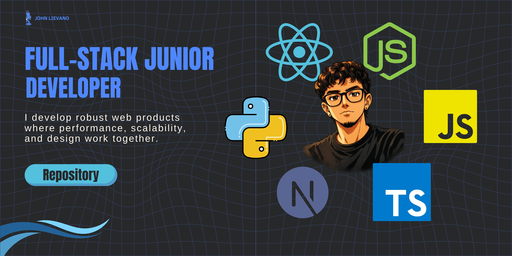

  <h1>Hi 👋, I'm John Esteban Liévano</h1>
  <h3>Junior Full Stack Developer</h3>

  

    Junior Full Stack Developer in technological training. Experienced in creating scalable web applications using <strong>TypeScript</strong>, <strong>JavaScript</strong>, and <strong>React</strong>. 
    Specialized in modern frontend development with <strong>Next.js</strong> and backend integrations with <strong>Node.js</strong>, prioritizing clean code and performance.
  

  

 

- 🚀 **Founder of Áurea Web**: Leading development projects for small and medium-sized businesses, creating scalable web solutions and corporate platforms.

- 💼 **Junior Full Stack Developer**: Developing web applications with **TypeScript** and **React**, implementing modern architectures and optimizing performance.

- 🛠 **Web Stack**: I build robust applications using **Next.js**, **React**, **TypeScript**, **Node.js**, and **SQL**.

- 🎓 **Education**: Technology in Informatics at Corporación Universitaria Minuto de Dios (5th Semester).

- 📫 **Contact me**: johnestebanlievanomendez@gmail.com

  <h3>Connect with me:</h3>
  
  
  
  
  
  

    

  <h3>Languages and Tools:</h3>
  
  
  
  
  
  
  
  
  
  
  

